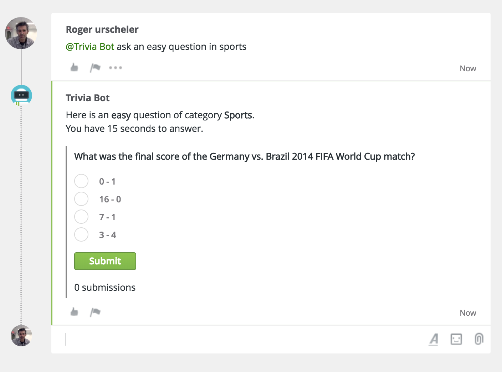
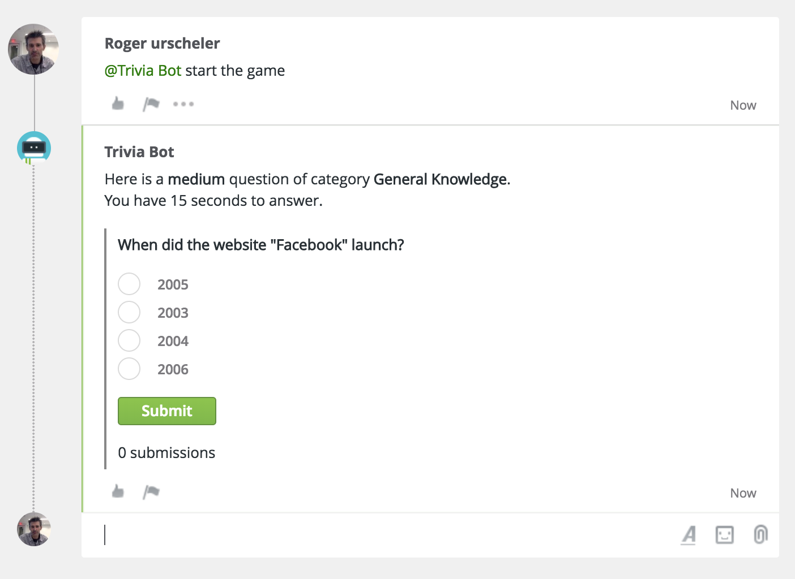
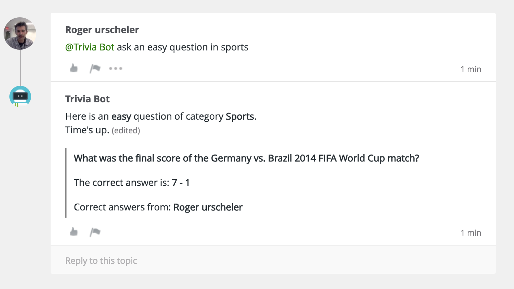
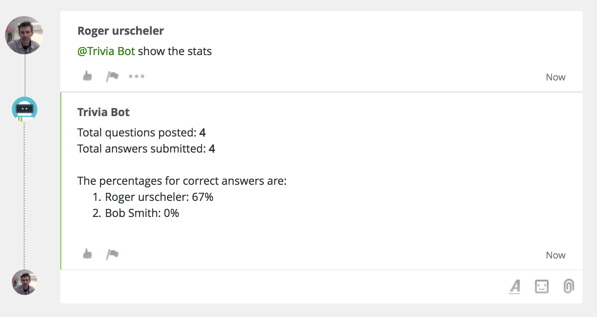
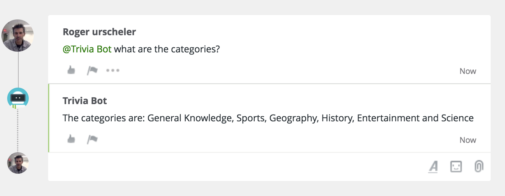

# Trivia

A trivia game for Circuit written with Google Cloud Functions, Google Cloud Datastore, DialogFlow and the Circuit REST API.

## Usage
On a Circuit conversation where the bot is a member, any participant can ask the bot to post a new trivia question, list the categories, show the stats and more.

For example: <i>@Trivia Bot ask an easy question in sports</i>

Any participant can attempt to answer the posted question. After 15 seconds the correct answer and the winners are shown.

### Screenshots
<kbd></kbd>
<kbd></kbd>
<kbd></kbd>
<kbd></kbd>
<kbd></kbd>

## Technical Overview
The cloud functions <b>start</b> and <b>stop</b> are used to register/unregister the Circuit webhooks <code>CONVERSATION.ADD_ITEM</code> and <code>USER.SUBMIT_FORM_DATA</code> via the Circuit REST API.

The cloud function <b>addTextItem</b> is called whenever a text item is posted in a conversation the bot is a member of. This function checks if the bot is mentioned, and if so passes the text content (utterance) to DialogFlow via the [DialogFlow SDK](https://dialogflow.com/docs/sdks). The official [DialogFlow Node.js Client](https://www.npmjs.com/package/dialogflow) is used.

DialogFlow then returns the matching intent with optional parameters.

If the intent is <b>New Question</b> the cloud function performs a REST API call to [opentdb.com](https://opentdb.com/api.php) to find a corresponding question. If the user does not specify a difficulty and category, then random values are used.

The cloud function then posts the question in the conversation using the new forms feature, and also adds the question to Cloud Datastore.

When a user submits an answer the cloud function <b>submitFormData</b> is called. If the timeout hasn't been reached and the user hasn't already submitted an answer to this question, then the submission is added to Cloud Datastore.

After the 15s timeout, then <b>addTextItem</b> function looks up the submissions and posts a reply with teh correct answer and the winners.

The <b>addTextItem</b> cloud function also handles the intents to show statistics and to list the categories.

## Run locally for development

### Prerequisites
* [Cloud Function Emulator](https://cloud.google.com/functions/docs/emulator) to run the functions locally
* [Cloud Datastore Emulators](https://cloud.google.com/datastore/docs/tools/datastore-emulator) to store the data locally
* [ngrok](https://ngrok.com/) or a similar tool is required to expose your local functions as public URLs so they can be registered for Circuit webhooks

### Deploy locally
Follow the same steps as in cloud deploy below. If you followed the emulator installation steps above, the deployment will be to your local emulators.

### Debugging
Use vscode to debug same as other projects. The difference is that before starting the debugger you need to start the debugger in the functions emulator via <code>functions inspect addTextItem</code> for debugging the addTextItem function.

## Deploy to Google Cloud

### Prerequisites
* gcloud account with billing enabled

### Deploy
1. Clone this repo
1. authorize gcloud to access the Cloud Platform via: <code>gcloud auth login</code>
1. Set the project via: <code>gcloud config set project my-trivia-game</code> (where my-trivia-game is your project name)
1. Setup a service account for authenticating the cloud APIs
https://cloud.google.com/docs/authentication/getting-started
1. Create a [dialogFlow](https://console.dialogflow.com) project and import trivia.zip
1. Rename <code>.env.yaml.template</code> to <code>.env.yaml</code> and update it with your configuration
1. Deploy the Datastore indexes via: <code>gcloud app deploy index.yaml</code>
1. Deploy the functions via: <code>gcloud beta functions deploy start --runtime nodejs8 --env-vars-file .env.yaml --trigger-http</code>
1. Deploy the remaining functions in the same way
1. Navigate to the start function to register the webhooks, e.g. https://us-central1-my-trivia-game.cloudfunctions.net/start

